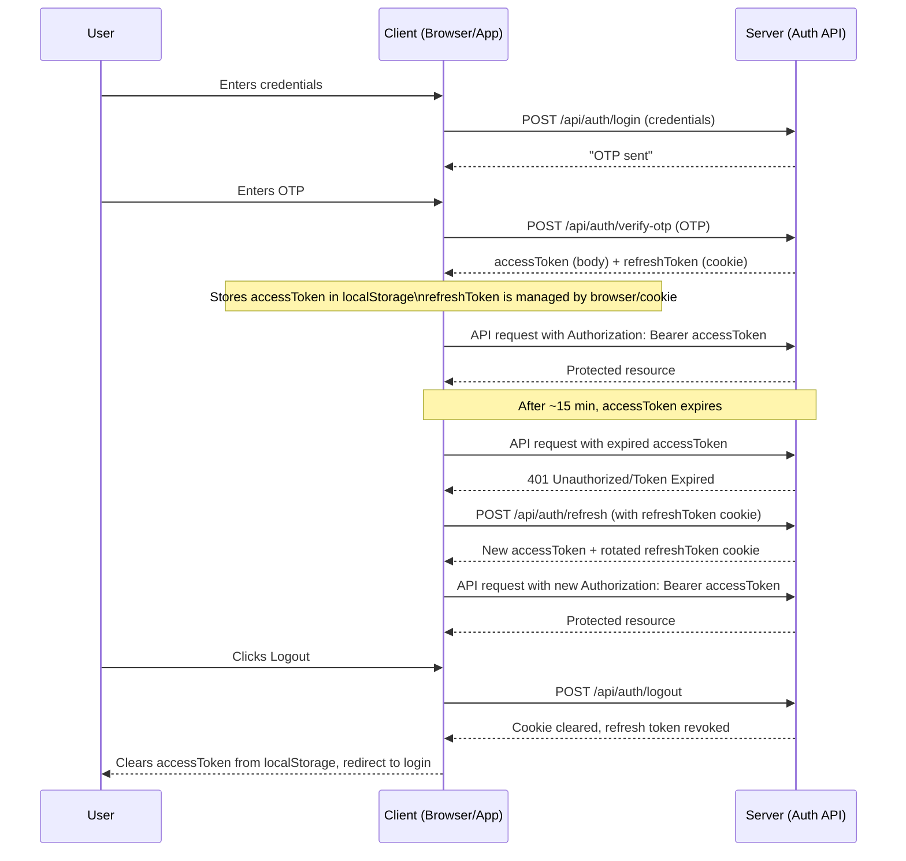

# Authentic: Token-Based Authentication System - Setup and Technical Guide

This guide outlines the steps required to clone the repository and start both the Express.js backend API and the React frontend application for development, along with a technical overview of the authentication system.

---

## Prerequisites

Ensure you have the following installed on your system:

- **Node.js** (Version 18 or higher)
- **npm** (comes bundled with Node.js)
- **Git** (required to clone the repository)

---

## 1. Clone the Repository

Clone the project repository to your local machine.

```bash
git clone https://github.com/MinKhantKyawSwar/Authentication-Cyber-Security-Assignment.git
```

## 2. Backend Setup (Express API)

The backend handles authentication logic, token minting, database interaction, and API endpoints.

### Navigate and Install Dependencies

Move into the backend directory and install the required Node.js packages.

```bash
cd Authentication-Cyber-Security-Assignment/backend
npm install
```

### Configure Environment Variables

Create a file named `.env` in the `backend/` directory and add your configuration. This is crucial for security (JWT secrets, database connection strings, etc.).

> Note: Replace the placeholder values with actual secure keys.

### Start the Backend Development Server

Start the server, which will typically run on `http://localhost:4000`.

```bash
npm run dev
```

The server is now running and ready to handle API calls.

## 3. Frontend Setup (React App)

The frontend is the client application that interacts with the backend, storing and managing the Access Token.

### Navigate and Install Dependencies

Move into the frontend directory and install the React application dependencies.

```bash
cd ../frontend # Assuming you are currently in the backend/ directory
npm install
```

### Configure Frontend Environment Variables

Create a file named `.env` in the `frontend/` directory to configure the base URL for the API (e.g., `VITE_API_URL=http://localhost:4000`).

### Start the Frontend Development Server

Start the React development server. It usually runs on `http://localhost:5173` and opens automatically in your browser.

```bash
npm run dev
```

The React application is now running and communicating with the Express API.

## Authentication System Technical Overview: Token System

The system provides secure, scalable, token-based authentication by separating concerns between two token types: the Access Token and the Refresh Token.

### Token Overview Diagram

The diagram below illustrates the purpose, storage, lifespan, and usage of each token.

```mermaid
graph TD
    subgraph Access Token (JWT)
        A[Type: JWT] --> B(Lifespan: ~15 minutes);
        A --> C(Storage: Client Memory/localStorage);
        A --> D(Usage: Authorization Header for ALL Protected API Calls);
        B --> E{If Expired/Invalid?};
    end

    subgraph Refresh Token (Opaque String)
        F[Type: Opaque String] --> G(Lifespan: ~30 days);
        F --> H(Storage: Secure, HttpOnly Cookie);
        F --> I(Usage: Only to Request a New Access Token at /api/auth/refresh);
        I --> J(Server Action: Token Rotation - New Refresh Token issued on successful refresh);
        G --> E;
    end

    E -- Yes --> K(Client must use Refresh Token to get a new Access Token);
    E -- No --> D;

    K --> I;
    I --> L(Server Validates Refresh Token);
    L -- Valid --> M(Issue New Access Token + New Refresh Token);
    L -- Invalid/Expired --> N(Force Re-Login/Logout);
```

### Authentication Flow Sequence Diagram

This sequence diagram illustrates the complete authentication and token-refresh cycle, including the initial login, API calls, token refresh, and logout.


